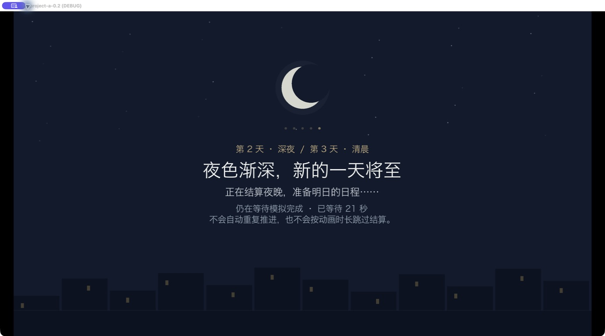
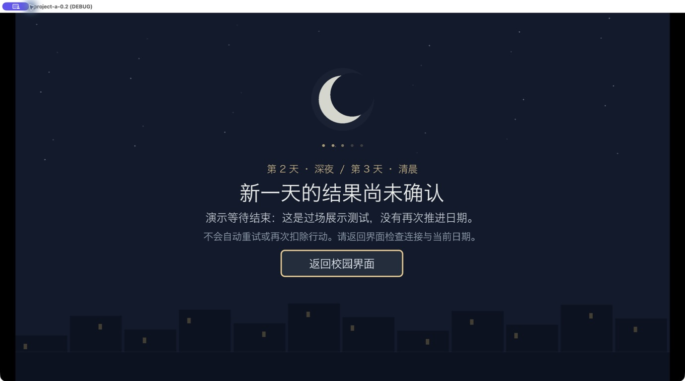

# 跨日过场验收

日期：2026-09-08。分支：`codex/campus-demo-architecture`，不合并 `main`。设计见 [跨日过场](../design/OVERNIGHT_TRANSITION.md)。

## 已完成

- 深夜→清晨显示轻量月光、星点和校园剪影动画，展示日期与真实等待时间。
- 绑定真实时段请求；只有收到次日早晨快照才淡出，普通日内推进不播放。成功后的淡出为 0.45 秒，不设置额外的最低等待时长。
- 暂停场景但不暂停 HTTP，阻止快捷键和重复点击穿透；结束时恢复原先的暂停和焦点。
- 保留失败、超时、日期不符提示与返回入口；不自动重试未知结果的命令。
- 跨日请求允许等待 180 秒，其他请求保留 30 秒；没有修改玩家聊天次数、模型 Key、NPC 决策或休息恢复。

## 验证结果

- Python 全局：**58 个模块、570 项全部通过**。[日志](validation/overnight/python.log)
- Godot 4.7.2 全局：**33 条流程全部通过**，包括新增跨日流程及既有导航、物品、交易、战斗、存档、成长、任务等。[日志](validation/overnight/godot.log)
- 最终跨日补测通过：实际离线服务推进四个时段、次日日期、重复请求保护、普通日内不播放、暂停时动画持续、三种分辨率、快捷键遮挡、手机暂停与焦点恢复、失败提示、错误日期、真实响应处理器的超时与重连、不重放命令。[日志](validation/overnight/target-final.log)
- 原生 Godot 窗口运行上述跨日测试，并检查过场与失败页。实际按 T、Esc 时等待画面保持，不打开底层手机或设置。[原生运行日志](validation/overnight/native.log)
- **0 次付费 API 调用**。本轮在 macOS 开发环境验证，Windows 实机仍须发布前验收。

## 原生窗口截图

以下为实际 Godot 渲染截图。为了截取等待过程，使用测试脚本的“暂缓完成通知”夹具；图中的等待秒数**不是性能测量结果**，正式游戏没有人为延长等待。真实后端跨日已由同一脚本前半部分验证。

当前是可替换的过场原型；不新增剧情，不修改七张地图与人物素材，不假定窗口动画代表 LLM 推理的具体进度。
