# 第 8 步交付：自主校园基础闭环与实机图

2026-09-07。第 1～8 步基础 MVP 已完成本轮验收；按用户要求在此停止，不进入第 9～12 步，不制作主线。当前仍是开发原型，不是完整可发行 Demo。

本次第五批补齐：实际设施与被困对象、战后处置、合法路线护送、受阻重试、交接行动成本、超时释放及旧存档迁移。实机发现的背景区域不同步和通行回调顺序问题也已修正。发布目标仅为 `codex/campus-demo-architecture`，不合并 `main`。

## 已完成基础能力

- 校园七图、区域道路和室内入口底座、200 名持久 NPC、四时段与主要行动；聊天、购物、普通移动等不耗主要行动。
- NPC 日程与实际活动、可见经历、联系人、异地消息、提议与答复、社团和组队。
- 库存、商店补货、私人报价/接受/拒绝、原子成交、物品使用、装备和恢复。
- 夜相资格与污染、三排人物卡、技能牌和共享费用、敌方回合、药品、撤退、胜败、跨战斗状态与休息恢复。
- 调查、来源、笔记、分享与隐瞒；阅读、案例、应用、反思、知识增伤及洞察、牌组配置。
- NPC 持续研习、缺物求助和实际交付；双论坛错峰竞争、任务锁、备战、集合、同规则后台战斗、实地侦察、设施处理与救援结算。
- 通用 LLM 接口底座、规则降级、存读档、事件与迁移。开发测试预算不等于玩家聊天硬上限。

## 验收结果

| 检查 | 最终结果 |
| --- | --- |
| Python 全局回归 | 57 模块、567 项全部通过；含 14 项新现场目标专项 |
| Godot 全套流程 | 32 项全部通过；包含导航、UI、物品、存档、战斗、调查、成长、计划、协作、后台战斗、接单、侦察及现场处置 |
| 真实旧存档 | 上一提交 `1b7dfcb`；世界、RNG、进行中战斗与原文件字节保留，新现场只用于后续新发布任务 |
| 实际窗口 | macOS Godot 4.7.2；11 组功能、14 张原始窗口截图，非设计稿或合成图 |
| 七日无玩家样本 | 种子 42：14 次封控、5 次稳定完成；5 次真实被困全部超时并留下后果 |

最终日志：`/tmp/campus-step08-final-python.log`、`/tmp/campus-step08-final-godot-serial.log`，均退出 0。新背景同步引发的场景回调错误已修复；并行轮有一次长场景准备超时，该轮不算通过，最终是 Python 结束后完整重跑 Godot 的结果。旧档证据：`/tmp/campus-sites-prior-create.log`、`/tmp/campus-sites-prior-verify.log`。

## 必须保留的边界

1. 本轮没有付费 API 调用，证明的是规则内核与可执行社会链路，不是 LLM 长期故事质量。模型只能表达与提案，事实和结算仍由程序校验。
2. 七日样本没有自然成功救援，不能说 NPC 已稳定、积极地优先救人。成功护送、转交、阻路和重试由受控专项证明；自然选择偏好仍待内容和平衡评测。
3. 护送是真实地点图通行和事件，不是逐像素跟随动画。大部分室内节点暂用所属区域图表现，学生中心另有可进入灰盒；七图精确楼梯、遮挡、门内外和夜景仍待整合。
4. 战斗、手机和地图是可操作原型。战斗区仍偏文字与下拉选择，个别窄控件、字体回退和调试 HUD 需要精修，不冒称发布级 UI。
5. 持续局势与跨日因果、失心者多解法、正式主线、完整校园生活、正式动作/卡面和 Windows 干净机器验收尚未完成。

## 实机截图

全部直接采自实际 Godot 窗口。测试使用隔离存档和空接口配置，不读取或展示个人密钥。原生验收场景会准备指定前置条件，逐组说明如下，不能把受控状态当作自然涌现。

### 1. 校园与人物同屏

运动场中的实际人物投影、时段、行动、生命和污染。来自战斗用药验收世界：购买与开战走正式命令；初始药房位置和受伤值属于受控前置。

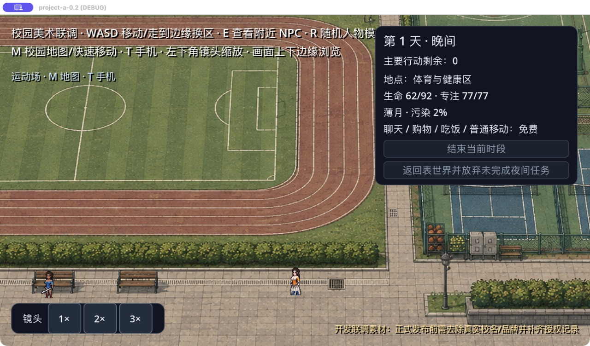

### 2. NPC 日程与已告知的计划

实际用餐、购买绷带、图书馆与学院活动形成日程；计划标明本人告知和日期，不公开内部账本。夹具为目标附加“研习验收”名字、设置风险和会面位置；此前四时段经历来自模拟执行，询问走正式接口。

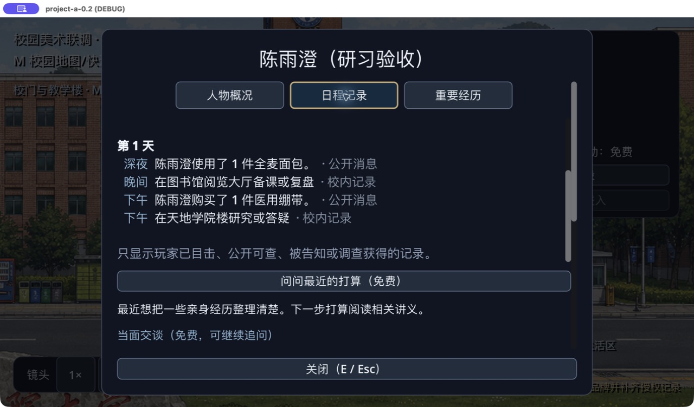

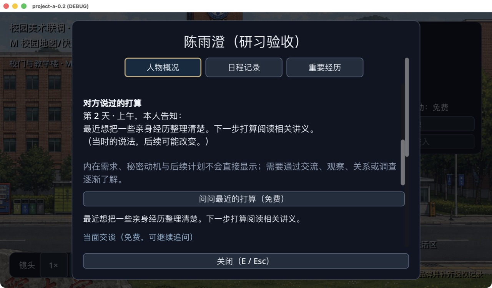

### 3. 手机联系人和消息记录

陈嘉言提出缺笔记本的请求，写明期限、地点并允许拒绝。夹具显式设置缺物、无钱和共处；添加联系人和求助经正式命令产生，不是自然发生率或 LLM 文本质量样本。

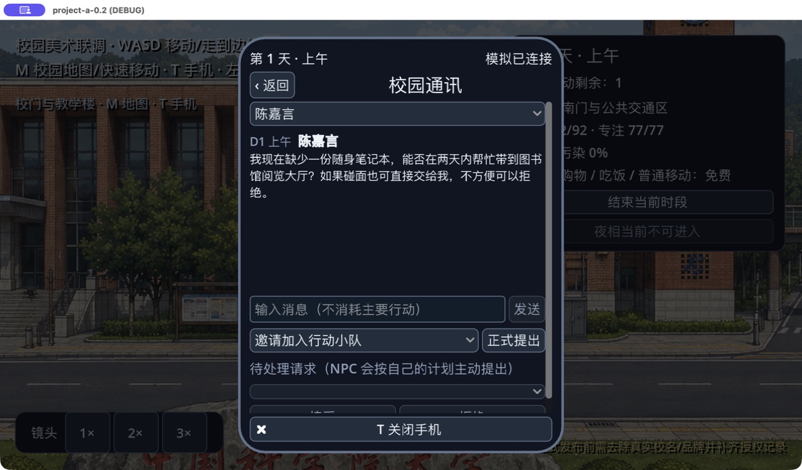

### 4. 社团活动与协作底座

天文社负责人、成员数、公共资源和多日活动时段。入社没有硬人数上限，但活动仍检查时段、地点、层域和行动。此图处于夜相，灰色按钮反映实际不可用条件；NPC 共同出击见第 10 组。

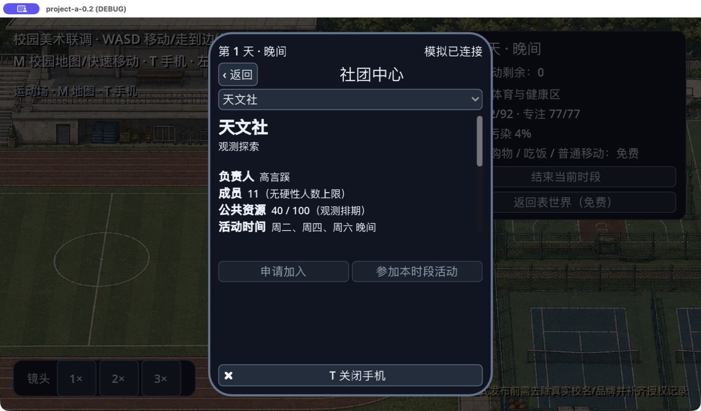

### 5. 物品、库存与经济

商城显示持有量、价格、负重、库存和已付款在途补货。售罄不能凭空购买，也不能隔空从商店拿物品。此世界实际推进两个时段并完成一项夜间任务，未注入售罄结果。

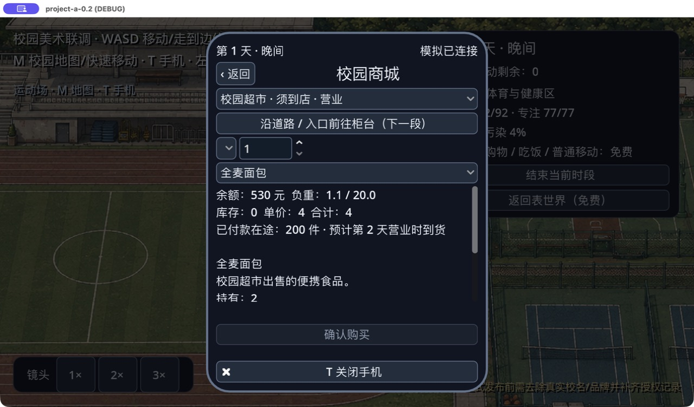

### 6. 三排人物卡与费用技能牌

正式战斗已开始，人物在前排；共享指令点、人物手牌、目标和基础指令可操作。显式受伤夹具用于验证治疗，不能声称这 30 点伤害来自敌人；敌方攻击、意图、胜败与恢复另由全局回归验证。

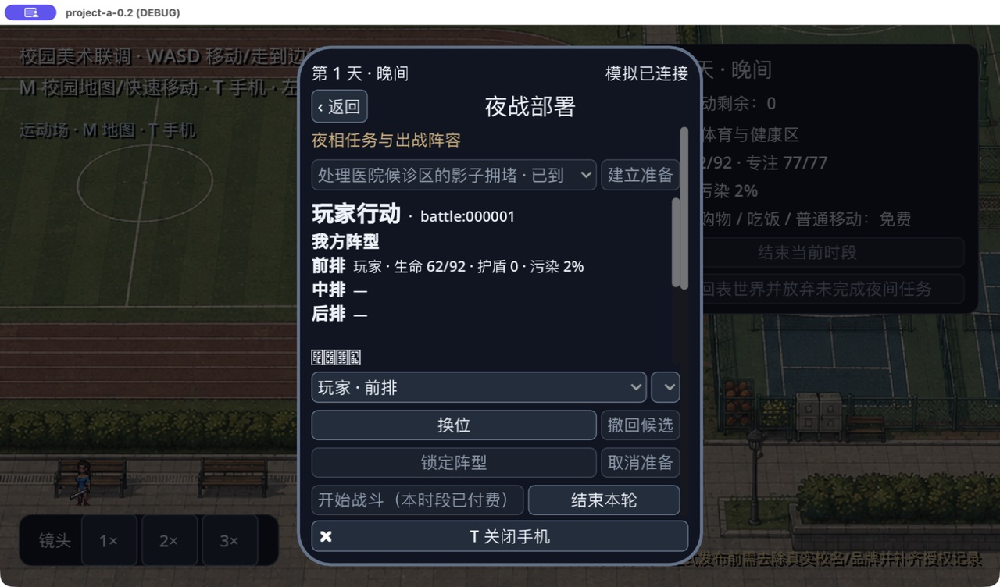

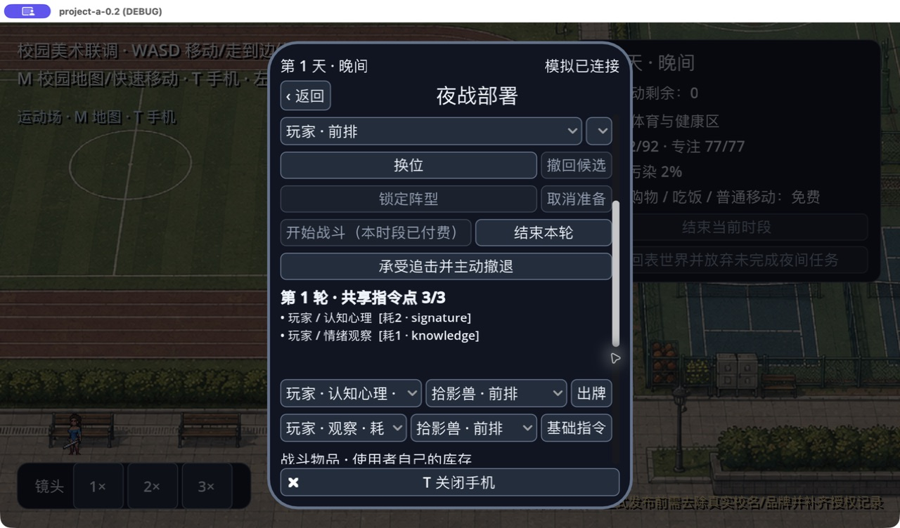

### 7. 调查与证据笔记

公告有来源、时间、个人可信度和已固定的笔记。可信度不是系统宣布真相；可以保密、询问和分享。夹具安排同场 NPC；公告、实际丢落物、搜查、记录与分享均走正式动作。

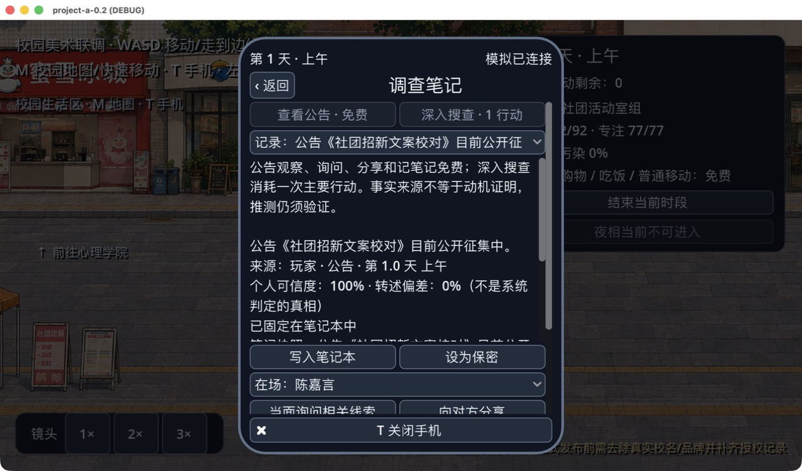

### 8. 知识成长

实际阅读消耗主要行动，理论从 0 到 20，对应异常增伤为 7%；案例、应用与反思没有凭空增加。夹具只安排玩家在住处，经验来自真实阅读命令，同时验证八张牌组配置。

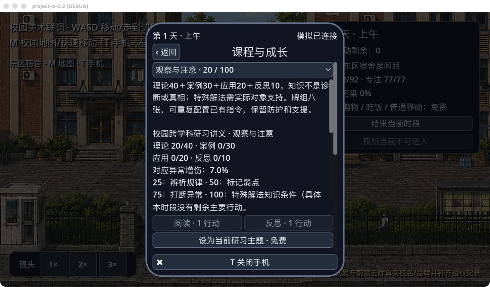

### 9. NPC 求助与真实履约

在第 3 组受控缺物世界中，实际点击答应，再点击当面交付。状态由承诺变为已交付，库存真实转移；仍为第 1 天上午、主要行动剩余 1。

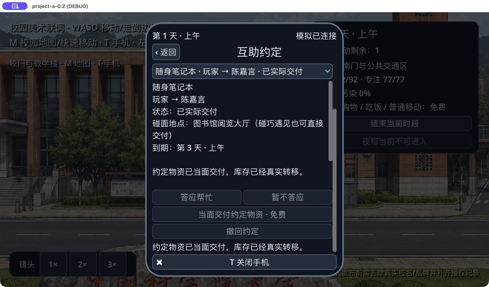

### 10. NPC 自主办事与现场目标

种子 46 连续推进三天，未注入友情、库存或胜利。孙若水、陈雨澄、梁知遥自行共同出击，实际完成卡牌战斗与门牌装置校准；玩家未参加，完成后才进入夜相看帖子。画面显示真实参战者和设施状态；任务历史与原报酬分配由该原生 Godot 流程断言核对。

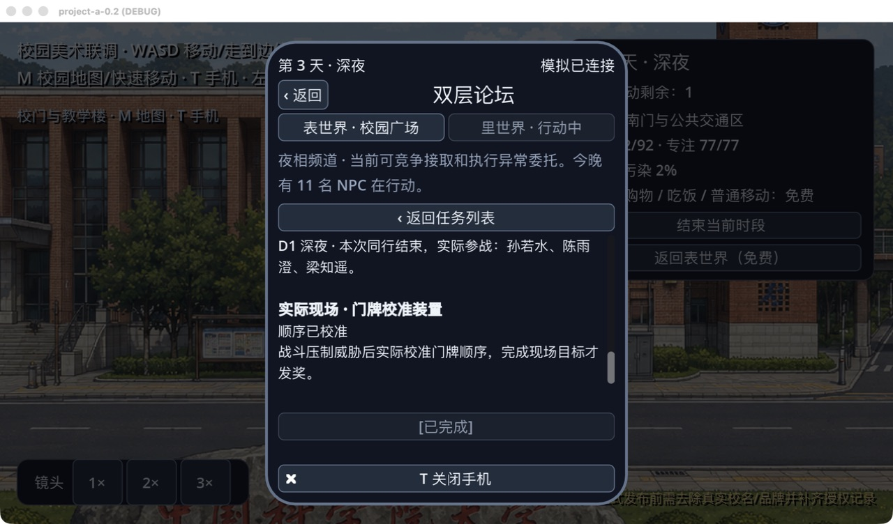

另一局玩家实际接单、抵达并经共同卡牌流程获胜，随后关闭异常闸口并分流，现场目标完成才发奖；未注入获胜或结算结果。

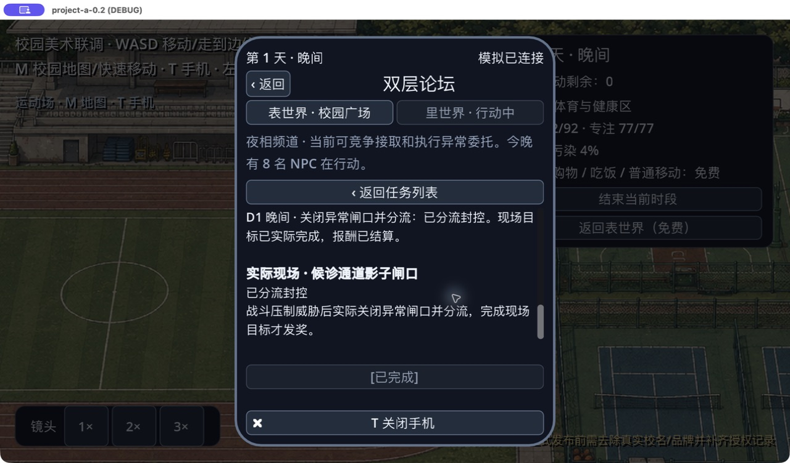

### 11. 存档

实际保存并确认后显示成功，记录天数、时段和区域。使用隔离目录，未覆盖个人存档，不含 API 密钥。备份、读取、取消、迁移和场景恢复另有完整流程验证。

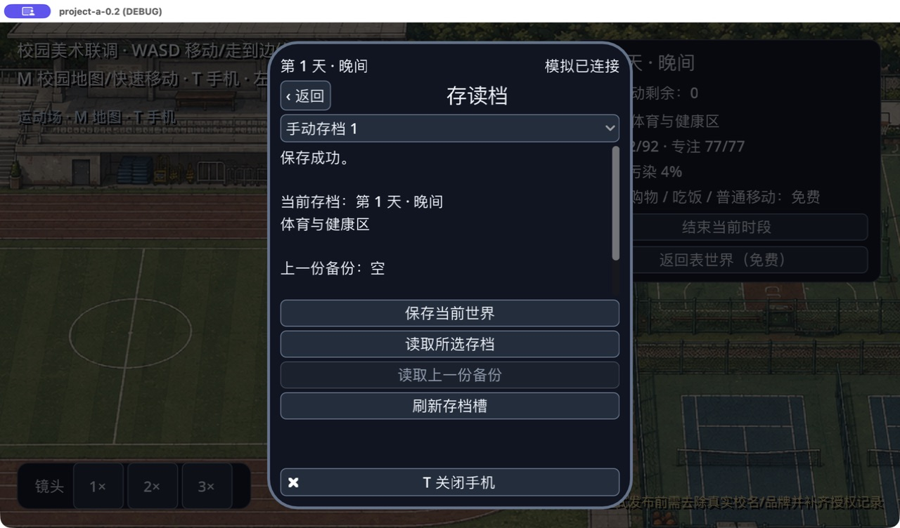

## 当前停止点

- [x] 1 程序与内容基线
- [x] 2 物品经济与存档基础
- [x] 3 统一 UI 基础
- [x] 4 卡牌战斗基础闭环
- [x] 5 调查证据
- [x] 6 知识成长
- [x] 7 NPC 持续目标与物资协作
- [x] 8 NPC 自主办事基础闭环、全局测试与实机截图
- [ ] 9 起：持续局势、多解法、完整生活与后续主线——本次不继续

后续顺序以 `design/IMPLEMENTATION_ROADMAP.md` 为准。保留私人未跟踪文档，不把旧清单历史勾选当作后续功能已完成。
