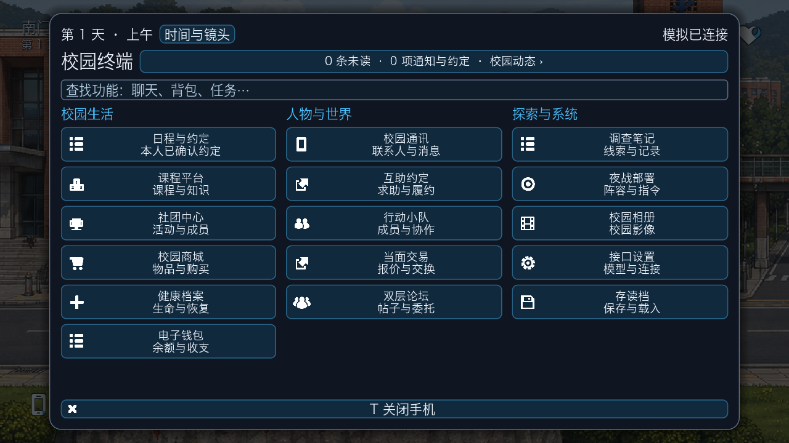
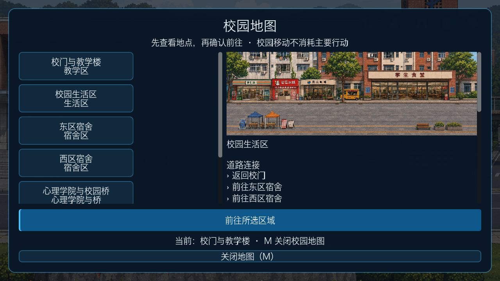
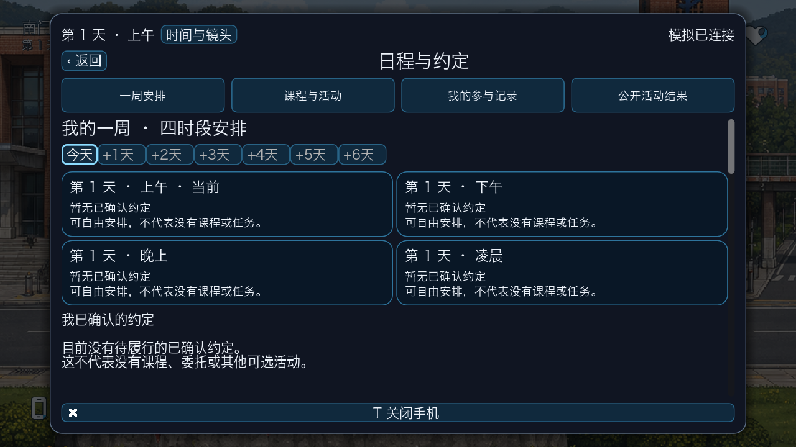
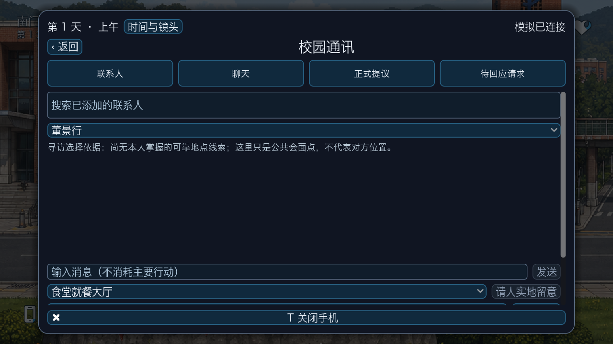
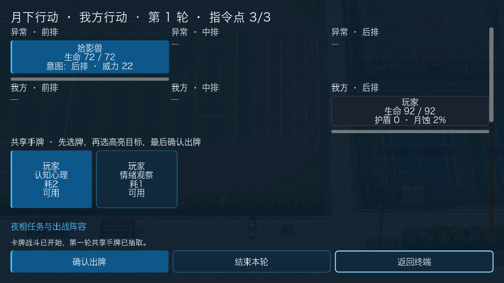
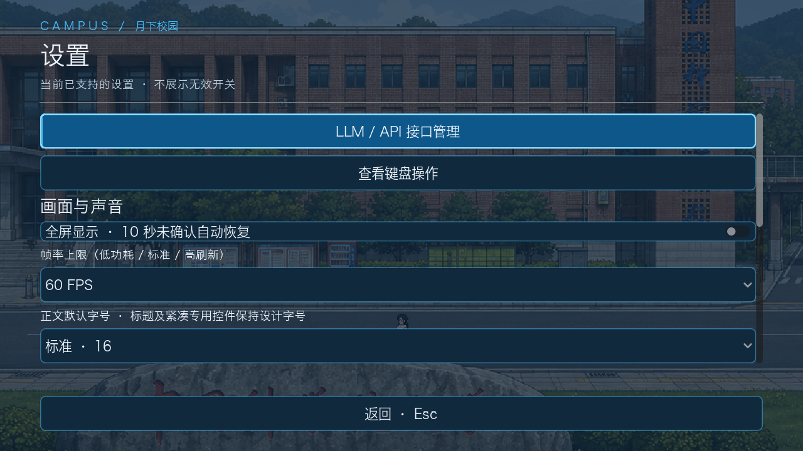

# UI03–UI18 统一版验收

## 本轮范围

在 UI01/UI02 的亮白、清蓝、现代校园与月相语汇上，完成到 UI18 的可运行界面第一版。保留原七张地图、既有玩法规则与通用 LLM 接口；UI19 主线界面未制作。本页区分界面实现、测试环境与后续定制，不把 UI 优化当作新增模拟规则。

| 编号 | 当前实现 |
| --- | --- |
| UI03 | 保留用户确认的四角 HUD 与六枚图标；本轮回归入口、通知、场景与预算 |
| UI04 | 七区域列表、场景预览、道路连接、公开建筑/室内与开放状态、已知任务与约定、当前活动和已知夜相通告；选中后再确认前往 |
| UI05 | 紧凑通知摘要、16 应用分类搜索；通知/动态不建立第二套游戏状态 |
| UI06 | 已有联系人搜索、逐人草稿、消息/正式提议/待回应快捷定位；仍无全员通讯录 |
| UI07 | 保留权威人物档案、按知情范围过滤的日志和加载更早记录；新增人物日志/当面交谈/联系与深度交互快捷入口 |
| UI08 | 好友/恋人/待回应分类和逐段关系入口；复用真实相处、同意、拒绝、结束及额外深度好友机制 |
| UI09 | 未来七天、每天四时段日历；本人的已确认安排、行动成本与对应管理入口 |
| UI10 | 双论坛真实任务状态、竞争/接取/完成、追踪与详情；加入动态页跳转 |
| UI11 | 今日/昨日/历史/通知筛选和分页；正式任务记录、本人生活参与/关系记录、供应通告、已知夜相压力、本人获知的近况/体验，跳回原事项或线索 |
| UI12 | 日历、课程活动、参与记录与公开活动结果的快捷导航；原有社团、兼职、医院、休息等操作保留并回归 |
| UI13 | 物品检索与消耗品/装备/其他分类；出售列表仅列持有且柜台接受的物品；既有购买/使用/转交/放下/拾取/装备/卸下及报价结算不变 |
| UI14 | 本人线索搜索、记录/分享/推测导航、动态到原始线索跳转；知识来源、可信度与推测仍按原投影显示 |
| UI15 | 小队/邀请/出击快捷定位、个人八张牌组配置、可用卡牌图鉴；队友真实集合与资格仍由模拟核验 |
| UI16 | 独立全屏战场、三排人物牌部署、敌方意图/生命条、共享手牌与指令点、合法目标高亮、选目标后确认出牌、权威结算反馈；药品/基础指令等细项继续复用下方操作区 |
| UI17 | 保留真实过夜等待与错误恢复；减弱动画可选；次日回顾在手机动态“昨日回顾”，不额外阻塞校园生活 |
| UI18 | 游戏总音量/静音、默认正文号、帧率上限、减弱过夜动画、本次会话全屏及 10 秒回退、键盘说明；API 配置与短连接测试、独立测试计量与游戏计量 |

## 关键边界

- 界面只展示公开或玩家已获知的投影，不用 NPC 私人计划解释故事。过去的本人陈述不是当前定位或医学结论。报名不是已经参加，聊天提议不是已承诺。
- 任务和场景条件仍实时核验；地图“开放”不是获得进入私密房间的资格。精确碰撞、遮挡与动画仍由场景专项继续完善。
- 接口测试只针对“已保存并应用”的配置，确认后发送一次短 JSON 测试；不传 NPC、聊天或存档，输出上限 128 Token，不自动重试。离线模式不调用供应商。
- 测试请求 ID 对最近 64 次结果幂等；这是重试保护，不是玩家调用次数上限。返回供应商实报输入/输出 Token；异常响应仍保留能够获取的计量，未知费用不会宣称为零。
- 测试计量属于本地服务当前启动期间；游戏计量随世界存档恢复，二者均不是供应商全账户账单。没有可靠单价，不计算伪精确金额。
- 全屏是本次会话设置，避免启动时跳转桌面空间；音量/字体/帧率/减弱动画保存到独立本机配置。默认正文号不覆盖标题与专用紧凑控件；自定义键位和更细画质档位不在这一版中伪装为可用。
- 战场复用原有命令控制器，UI 不再算一遍伤害。提示中的基础效力不等于最终伤害。角色/怪物专用立绘、卡面插画、战斗动作与特效音仍留给后续美术定制。

## 验证记录

- Godot 4.7.2：全局 **69 项**流程已通过（35 + 34 两组，独立离线端口与存档）。包含模拟服务、七图场景、移动、保存读取、社交关系、日程、交易、调查、队伍、战斗、过夜及故障恢复。
- 最后界面补丁另跑手机布局、活动动态、战斗部署/出牌、偏好/接口探测、日程等专项。窗口覆盖 960×540、1280×720、1920×1080。
- Python 全量：**96 模块 / 914 测试全部通过**（`GLOBAL_OK 96 914`）。
- 新接口单元测试：确认门槛、离线不调用、128 Token 输出上限、异常脱敏、同 ID 不重复调用、世界状态不变。
- 本轮没有向用户的付费 API 发出测试请求。LLM 流程使用本地回环模拟供应商，界面探测使用离线模式。
- 后台 OpenGL 实际渲染，未要求 Godot 弹到前台；最终截图在工作区 `outputs/campus-ui03-ui18-final/`。
- **Windows 原生人工验收尚未执行**；不能把 Mac/无头测试写作 Windows 已通过。发行前仍需对 Windows 的显示模式、输入法、字体与 API 网络环境做实机检查。

## 如何查看

打开 Godot 项目 `game/project.godot`，F6 不用于整体入口，使用 F5 运行项目。手机内点击“校园动态”，在各应用顶部用快捷导航定位。进入夜相、接取并到达战斗任务后，从“夜战部署”打开独立战场。按 Esc 打开暂停菜单，在“设置”查看音量、显示与 API 测试。

参考：既有自制月相 SVG 与 [Kenney Game Icons（CC0）](https://kenney.nl/assets/game-icons)；借鉴同类游戏的信息分层，不复制商业游戏美术。显示/声音采用 [Godot Window](https://docs.godotengine.org/en/stable/classes/class_window.html) 与 [AudioServer](https://docs.godotengine.org/en/stable/classes/class_audioserver.html) 原生接口。

## 实际渲染截图

以下是 1280×720 后台运行截图，不是设计效果图。终端、日程等来自离线初始世界；战场来自通过真实模拟命令进入的测试战斗。空记录代表该存档尚未产生对应经历，不用假数据填充。

### 校园终端

### 七区域地图预览

### 七天四时段日程

### 联系人与通讯

### 独立卡牌战场

### 本地设置

