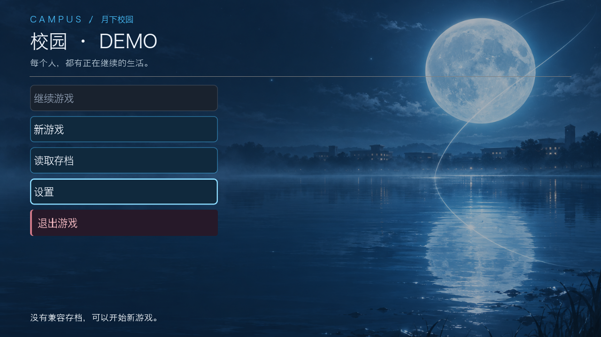
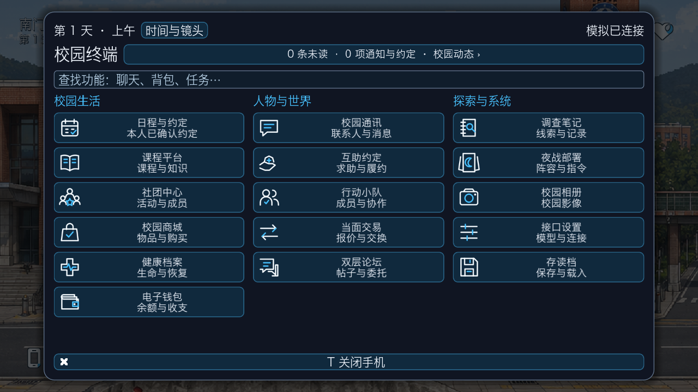
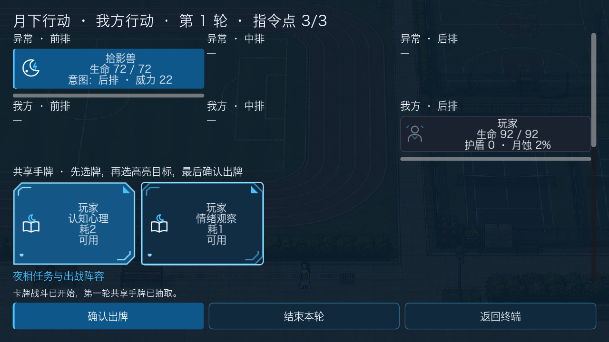
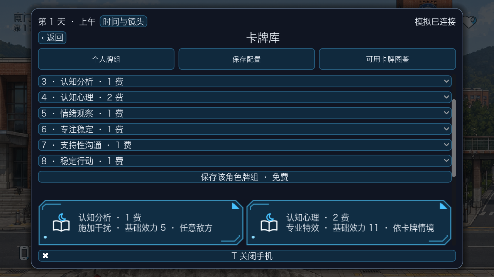

# UI 图像美术第一批

本轮在 UI01–UI18 统一版上补充 **23 份素材**：1 张生成氛围图、20 枚原生 SVG 图标、2 个卡面边饰。

## 已接入内容

- 标题页：月光、湖面与轨道弧线，匹配表/里世界主题；保持菜单文字、输入与真实存档状态。
- 手机：16 个应用各有对应图标，替换重复使用的通用图形；蓝白一致，保留搜索、通知、草稿和已确认的布局。
- 夜战：人物/异常语义标识，知识/支援/攻击牌图标，普通与选中卡面边饰；费用、所有者、合法目标和出牌仍来自原控制器。
- 卡库：同一套卡面边饰与效果类别图标；基础效力仍明确不等于最终伤害。
- 没有重画校园七图、捏造角色头像、制作主线图片，也没有修改聊天额度或夜间 NPC 判断。

## 验收

- 新素材 Godot 加载、尺寸、卡面样式缓存、图标语义、非交互装饰检查已通过。
- 后台 Godot 实际渲染已核对标题、手机和战斗截图；960×540、1280×720、1920×1080 专项检查通过。
- Godot 全局 **70 条流程通过**（35 + 35 两组）；最终采样调整后追加素材、手机布局、卡牌战斗、系统菜单与成长 **5 条专项通过**。
- Python **96 模块 / 916 项全量测试全部通过**（`GLOBAL_OK 96 916`）；UI/资源完整性另外 **16 项专项通过**。
- 本轮没有调用玩家配置的 LLM API；氛围图使用内置 imagegen 生成。
- Windows 原生实机、定制角色立绘和战斗动作不在本次已验证范围。

## 实际截图

这些是运行时截图，不是拼接效果图。标题/手机来自独立离线测试世界；战斗通过真实任务与部署命令进入。无伙伴和经历的空状态没有用虚构数据填充。

## 文件与后续替换

素材路径、来源、参考和生成提示词见 [素材说明](../game/assets/ui/campus_atelier/README.md)。后续以此蓝白体系扩展，保持图标语义和文字可读性，不直接复制商业游戏素材。
