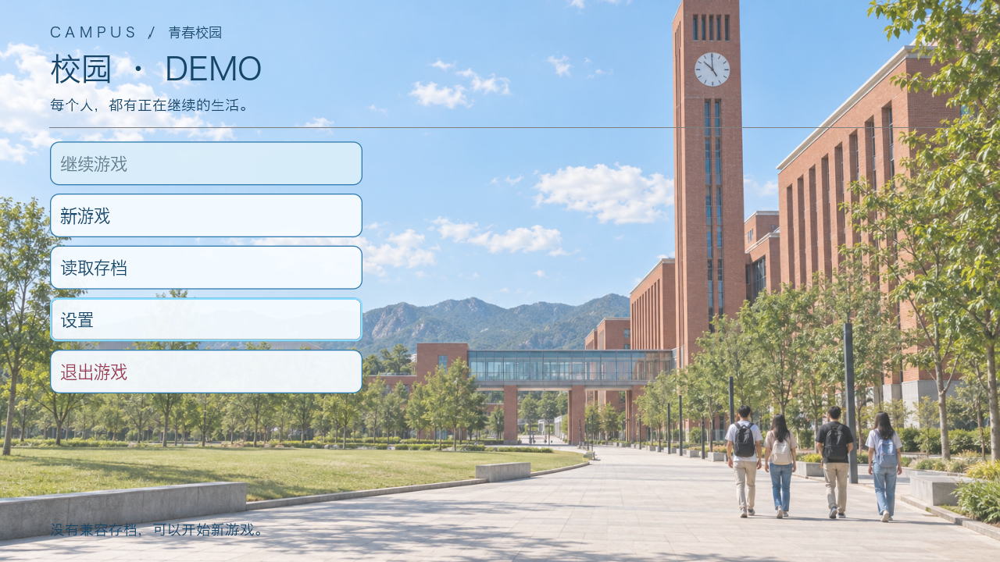
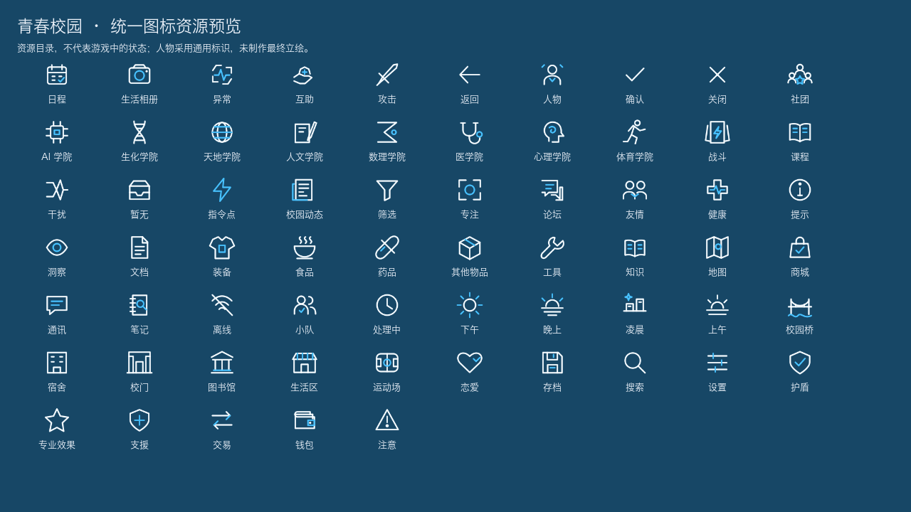
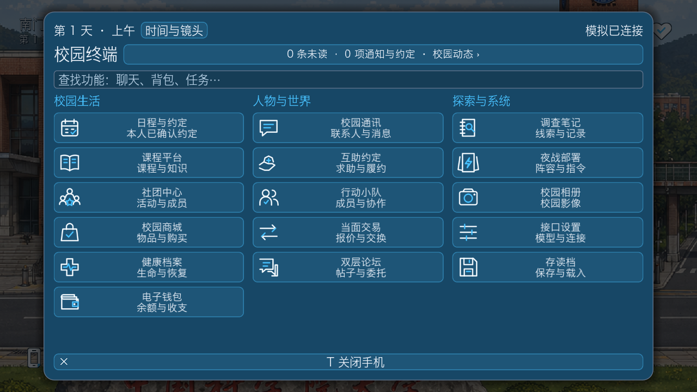
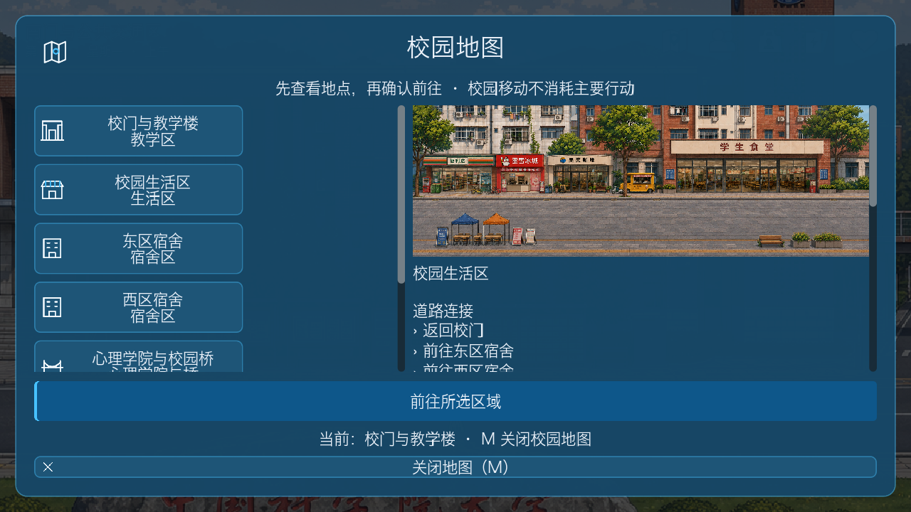
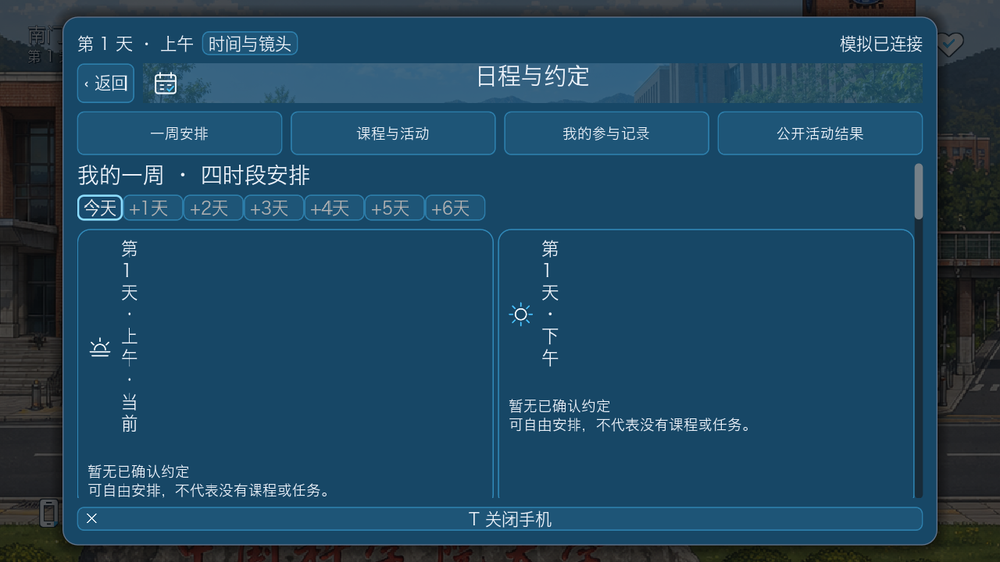
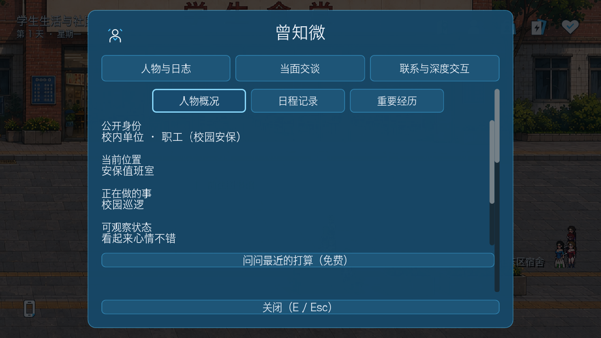
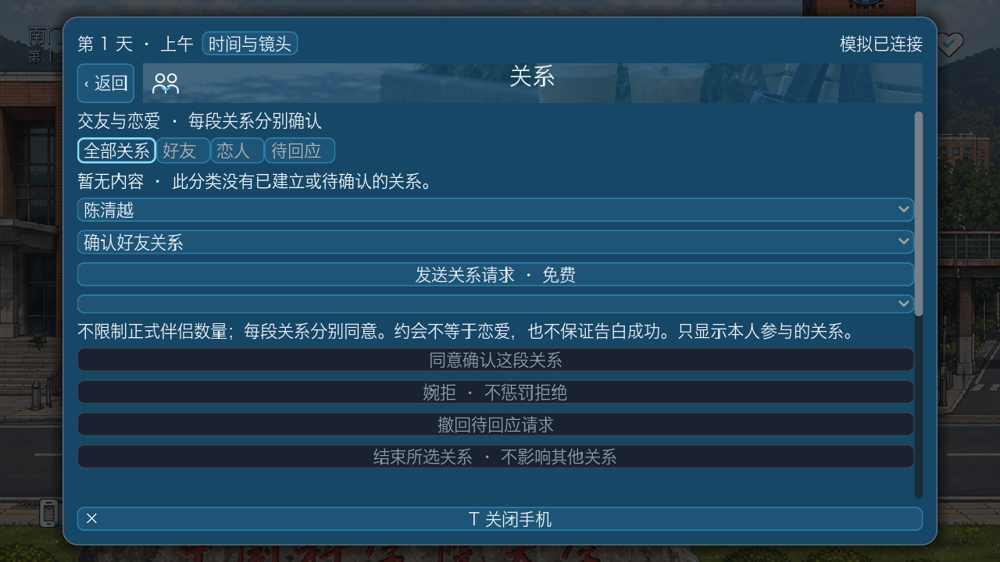
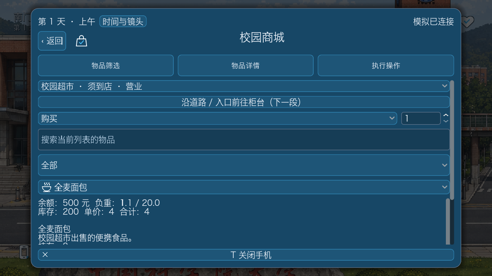
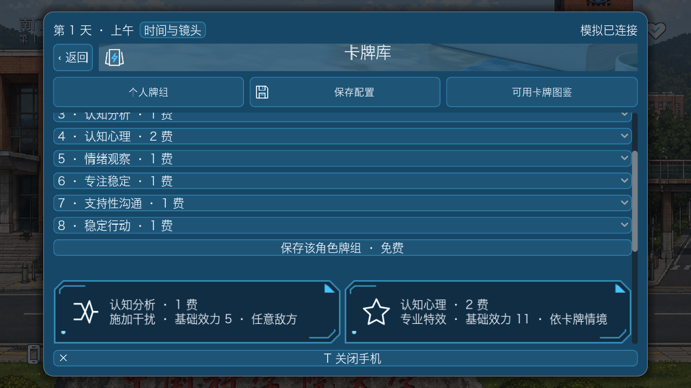
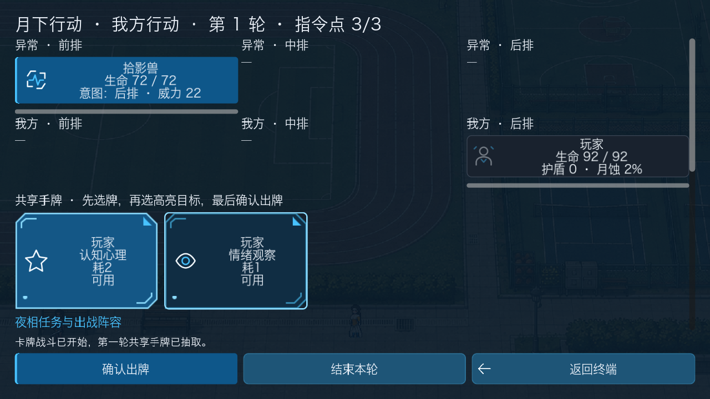

# UI 美术第二批验收记录

日期：2026-09-11。分支：codex/campus-demo-architecture。范围：现代青春校园 UI 美术，不改玩法或模拟层。

## 本次完成

- 明亮写实的红砖钟楼校园封面，参考雁栖湖校区建筑语言；浅色菜单按钮、深蓝文字。
- 学习桌面、校园社交桌面两张写实图片，适度用于手机页眉。
- 图标目录从 20 扩至 65 枚，补充 45 枚：八学院、地图地点、四时段、物品分类、关系类型、战斗效果及通用控件。
- 地图区域入口、NPC 公开学院、日历、商城、关系概览及卡牌效果已绑定；仍保留文字说明，不靠图案猜机制。
- 面板由近黑色提亮为校园蓝，HUD 卡牌/关系图形不再依赖月相；过夜装饰为简洁钟表。
- 全部图片/提示词/参考来源在 [素材说明](../game/assets/ui/campus_atelier/ART_BATCH_02.md) 中登记。内置 imagegen，不声称指定模型型号。
- 原七张可行走地图与业务规则不变。未制作角色专属立绘、怪物原画或动作；部分通用图标先备齐资源，没有强行加进每条提示。

## 美术参考的选择

| 参考特点 | 本轮采用 | 不采用 / 延后 |
| --- | --- | --- |
| 雁栖湖校区红砖、钟楼、连廊、远山 | 原创封面建筑语言 | 不照搬校名、校徽、精确建筑布局 |
| 公开学生航拍与写真 | 收录为后续构图和生活氛围参考索引 | 未完整观看视频，不下载或转载个人作品 |
| 图书馆与咖啡空间 | 学习与社交小景，纸张、木面、自然光 | 不把生成图冒充学校实拍 |
| 日夜差异 | 封面与生活明亮；夜战仍保留较深背景 | 不提前确定月亮是故事核心 |
| 朋友的七张校园图 | 继续用于场景和地图预览 | 不因生成封面而改变碰撞或 NPC 行走 |

## 测试状态

- Godot 全局 **70 / 70 条流程通过**，分两组各 35 条运行。
- 最后微调后的素材、人物检查器、常驻 HUD 与场景整合专项 **4 / 4 通过**。
- Python 全局 **96 个模块 / 918 项测试通过**（原 916 + 新增 2 项素材与语义覆盖测试）。日志：/tmp/campus-youth-ui-20260911-modules/。
- 实际隐藏窗口完成标题/新游戏/存档/设置、手机各页、NPC、战斗及 65 枚图标总览截图；已人工查看代表图片。

使用 Mac Godot 4.7.2，所有世界/API 流程为离线或受控本地测试，未调用付费游戏 LLM。Godot 日志目录：campus-godot-checks-wcc68_5q、campus-godot-checks-6r9s2aod、campus-godot-checks-rldtlnho（系统临时目录）。实际截图日志：/tmp/campus-youth-capture.QRFg3Q/；选中的截图已复制进本仓库。

首轮捕获发现并修复手机缺少资源引用、无学院成员 college_id 为 null 时的转换问题；失败日志保留，不计为最终通过。图标总览的初版被缩放裁切，已修复为固定预览画布并增加完整边界断言。

## 实际 Godot 截图

以下均为 Godot 后台窗口实际渲染，不是 UI 效果合成。图标总览是明确标注的资源预览，不代表游戏世界状态。

### 开始菜单

### 图标资源总览

### 手机入口

### 七张地图入口与原场景预览

### 日程四时段

### NPC 公开身份（无学院的职工使用通用人物标识）

### 关系页（新存档真实空状态）

### 商城与物品分类

### 卡牌效果与卡框

### 实际战斗回合

## 重现

- Python 全量：Python 3.12 执行 production/validation/step10-routes/run_python_full.py，参数为日志路径前缀。
- Godot 全量：Python 3.12 执行 production/run_godot_checks.py --godot <Godot 可执行文件>。
- 隐藏窗口截图：capture_campus_system_menu.gd、capture_campus_ui_pages.gd、capture_campus_art_gallery.gd、test_campus_combat_round_flow.gd；每次使用隔离存档、设置文件和独立端口。
- Windows 原生运行尚未复测；本轮结果不等同于 Windows 发行验收。
- git diff --check 与文档本地图片/文件链接检查通过。仅提交本批 UI、素材、测试与文档；不包含原有私有设计文件及交接文档的修改。
