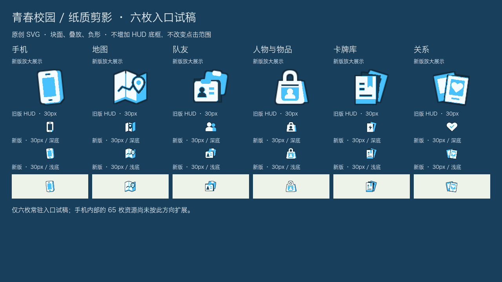
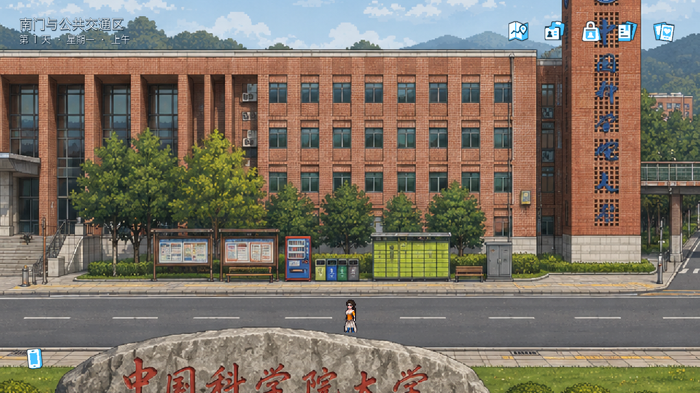
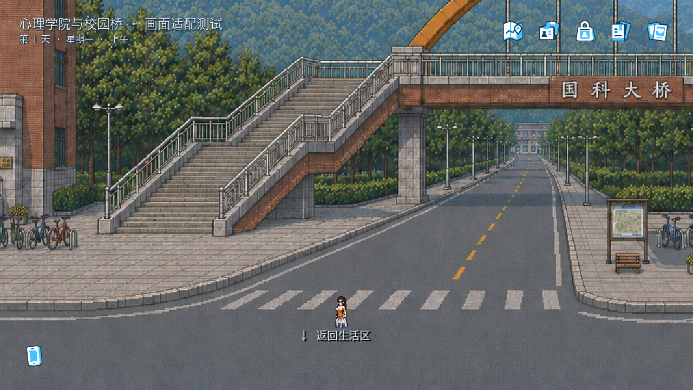

# 校园纸质剪影 · 六枚入口验收

2026-09-11。分支：codex/campus-demo-architecture。

## 本次范围

按用户确认的方向，先重做六枚常驻入口：手机、折叠校园导览图、叠放证件、帆布包、书签式指令卡、叠放照片。采用纸白/蓝色块面与负形，不添加月相、星轨、统一底框。

资源及详细规范见 [campus_paper/README.md](../game/assets/ui/campus_paper/README.md)。原创 SVG，不调用生图或游戏 LLM；原 campus_moon 六枚图标保留，仅切换 HUD 的资源引用。

保持 30px 图形、46px 热区、原入口位置/顺序和 0.16 秒焦点反馈；不修改地图、NPC、任务、聊天或通知规则。手机内部 65 枚图标及表单布局尚未按此方向扩展。

## 实际 Godot 图片

### 造型对照及实际大小

以下由引擎加载实际资源并使用相同着色器渲染；包含旧版 HUD 与新版，而非拿手机内部线性图标冒充旧版 HUD。浅色方块只用于预览背景，不会加入常驻界面。

### 校门场景

### 焦点反馈

### 校园桥背景适配

七张地图均已生成适配截图；上述桥图只切换美术背景，不表示玩家实际完成旅行，也不是路径/碰撞验收。

## 验证记录

- 实际后台渲染：六枚造型、大图/30px 浅底/深底、校门 HUD、焦点、入口页面和七张地图适配，通过。
- 新增静态测试：六个本地 SVG 的尺寸、双色块面、无嵌入位图、资源引用与热区保持。
- Godot 全局 **70 / 70 条流程通过**；新增资源引用断言后的 HUD 专项再次通过，包含三种分辨率、六入口、键盘焦点、物品页与通知去重。
- Python 全局 **96 个模块 / 919 项测试通过**（本轮新增 1 项）；UI 静态专项 **15 / 15 通过**。全量日志：/tmp/campus-paper-ui-20260911-modules/。
- 隐藏窗口截图工具改为主动请求实际绘制，不等待可能被跳过的 frame_post_draw；仅修改测试工具。
- 不进行付费 LLM 调用。Mac Godot 4.7.2；Windows 原生验收仍待完成。
- git diff --check 和文档本地链接检查通过。原有私有设计文件、交接文档修改不纳入提交。

日志：系统临时目录中的 campus-godot-checks-glfirb2o、campus-godot-checks-ueqtj0bl、campus-godot-checks-n49kv8cs；截图原始记录位于 /tmp/campus-paper-icons.Np6re1/，选中的图片已复制进仓库。

## 后续边界

这六枚为已接入的方向试稿，供用户审阅后扩展。主应用可沿用块面和生活物件；返回/关闭等辅助操作仍可保持线条。学院、社团应有不同语义，不能全部变成书本或证件。
