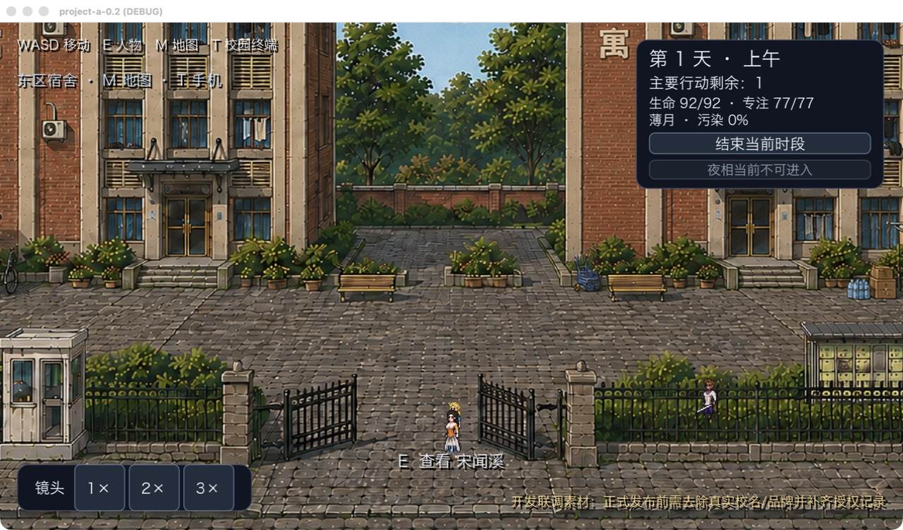
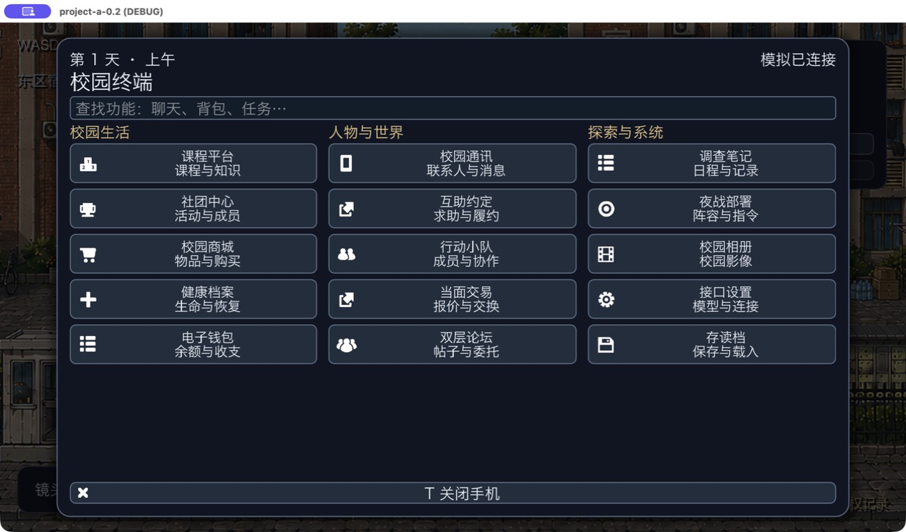
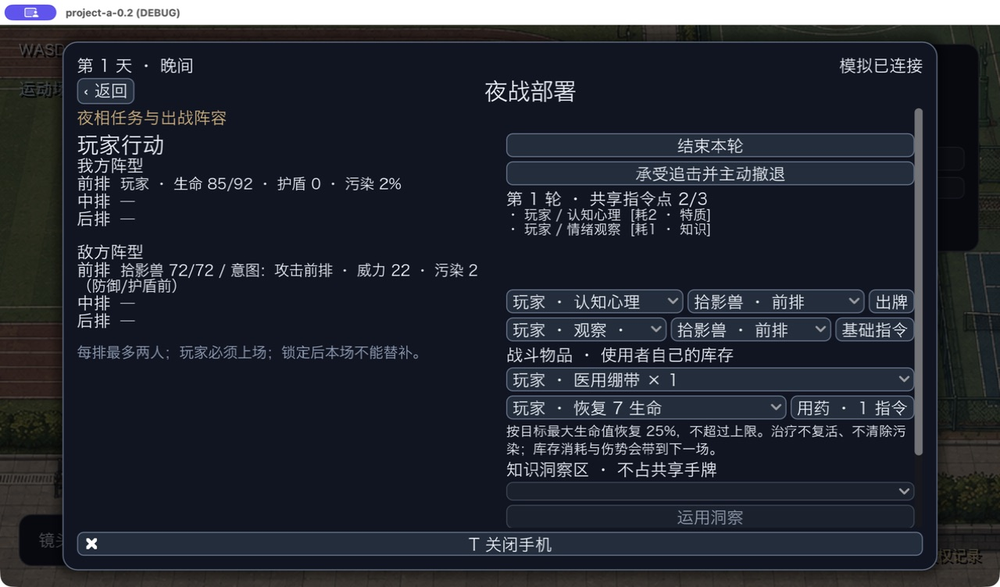

# UI 与每日规划优化：验收记录

2026-09-08。分支：`codex/campus-demo-architecture`，不合并 `main`。设计与参考来源见 [方案](../design/UI_RUNTIME_OPTIMIZATION.md)。本轮是既有系统修整，没有推进主线或路线第 9 步。

## 完成内容

- 终端宽屏化，三组各五个入口；保留搜索、键盘导航、固定返回/关闭与原有 15 项功能。
- 精简常驻 HUD；共享主题、中文字体及按钮状态贯穿页面。中文普通/粗体字形增加实际 Godot 检查。
- 战斗左右分栏，区分准备与正式战斗操作，减少嵌套滚动和无效空控件，手牌类型中文化。
- 跨日一次完整 NPC 日程规划；日内读取既定安排并执行实际路线和行动。任务竞争、规则互动、紧急采购和有效性检查继续运行；玩家主动聊天仍可即时调用模型。
- 新世界/旧档缺少当日日程时仅本地补齐一次。每日计划可存读，不因读档重复请求模型。模型失败继续规则回退。
- 历史命令结果采用不可变 JSON 缓存，避免每次事务深拷贝全部旧命令事件；保留旧缓存读取、原子性、日志和重放。

## 性能实测

同一台 Apple M5 Mac、Python 3.9，种子 42、200 NPC、规则模式，无付费模型调用。顺序执行修改前后相同脚本，各推进 28 次时段，即 7 天。基线为 `6da55104e61bf25f389ca08235f28508e57b82b9` 的模拟/内容代码；优化后为本报告所在提交。最终样本采集时没有并行运行本轮回归或测试游戏。

| 后端命令及返回快照耗时 | 修改前 | 修改后 | 变化 |
| --- | ---: | ---: | ---: |
| 日内推进中位数 | 0.9191 秒 | 0.5109 秒 | 减少约 44% |
| 日内推进最大值 | 1.5097 秒 | 0.7319 秒 | 减少约 52% |
| 跨日推进中位数 | 1.0478 秒 | 1.2131 秒 | 增加约 16% |
| 28 次推进合计 | 26.4306 秒 | 19.1441 秒 | 减少约 28% |

跨日变重是集中规划的预期取舍；日内等待缩短，完整周期也减少耗时。这不是帧率或 Windows 性能测试，不含真实 API 网络等待、Godot 绘制和 HTTP 传输。不同日程策略会改变后续事件轨迹，因此这是同种子玩家流程比较，不是事件数量完全相同的微基准。单次样本受机器负载影响，不作普遍性能保证。并行回归期间的初测波动较大，没有用于本表。

原始逐时段数据：[修改前](validation/ui-runtime/latency-before.log)、[修改后](validation/ui-runtime/latency-after.log)。脚本：[benchmark_campus_phases.py](benchmark_campus_phases.py)。

## 验证结果

- Python 全局：**58 个模块、570 项测试全部通过**。包含 7 天确定性运行、NPC 自主活动与交易、论坛、社团、组队、出击、救援、调查、成长、API 契约和存档；新增日内零自动模型请求、跨日全天候选、计划读档、旧档补齐、去重缓存重放测试。
- Godot 4.7.2：**32 条流程全部通过**，涵盖七图导航、角色检查、主题、HUD、手机、设置、请求生命周期、物品、供货、战斗、恢复、成长、互助及自主任务等。
- 布局补测：960×540、1280×720、1920×1080；首页 15 项无须滚动、无横向溢出，焦点可达，战斗中部署控件隐藏、出牌控件显示；最后 HUD 收紧后再次通过布局与状态反馈检查。
- 原生窗口人工操作：打开终端、进入战斗页并使用一份绷带，玩家生命 `62→85`、绷带 `2→1`、共享指令 `3→2`，结果与后端一致。另在校园场景手动推进上午→下午→晚间，观察 NPC 改变位置并继续活动。
- 付费 API 调用：**0**。模型协议测试使用本地假提供者；没有改用户 Key、Base URL 或玩家聊天上限。

日志：[Python](validation/ui-runtime/python.log)、[Godot](validation/ui-runtime/godot.log)、[最终布局补测](validation/ui-runtime/layout.log)。可在仓库根目录运行：

```sh
python3 -m unittest discover -s tests
python3 production/run_godot_checks.py --godot /path/to/Godot
python3 production/benchmark_campus_phases.py --days 7
```

## 实际游戏截图

均为原生 Godot 运行窗口，不是 UI 概念图。校园展示使用隔离的成长测试存档；战斗使用明确设置伤势的测试夹具，不作为自然生成故事的证据。

### 精简后的校园 HUD



### 校园终端：15 个入口



### 战斗页：阵型、手牌和用药后的真实状态



对照存档：[旧 HUD](screenshots/ui-runtime/hud-before.png)、[旧手机首页](screenshots/ui-runtime/terminal-before.png)。

## 保留边界

- 当前是可替换的原型 UI，不是最终定制美术；七张场景图与人物素材没有替换或删改。
- 自动模型工作集中到早晨后，白天的 NPC 自发互动使用规则响应；玩家发起的聊天与手机提议仍按原接口即时处理。后台预算保留，不保证 20 个焦点 NPC 每天都实际请求模型。
- 本轮没有验证真实 API 的故事表现、长期涌现质量或 Windows 实机效果。Windows 仍是目标平台；发布前需测试系统中文字体覆盖，或捆绑授权字体。
- 新程序可读取旧缓存，新格式存档不承诺能被旧程序读取。本次仅提交本任务相关文件，保留其余本地修改。
